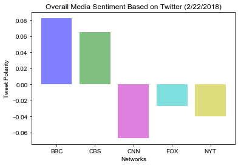

### Distinguishing Sentiments - News Mood

Created a python script to perform a sentiment analysis of Twitter activity from various news outlets (BBC, CBS, CNN, Fox, and New York times) and visualize findings.

Languages and Tools:
- Tweepy
- Pandas
- API Calls
- Matplotlib
- Seaborn
- TextBlob
- VADER

